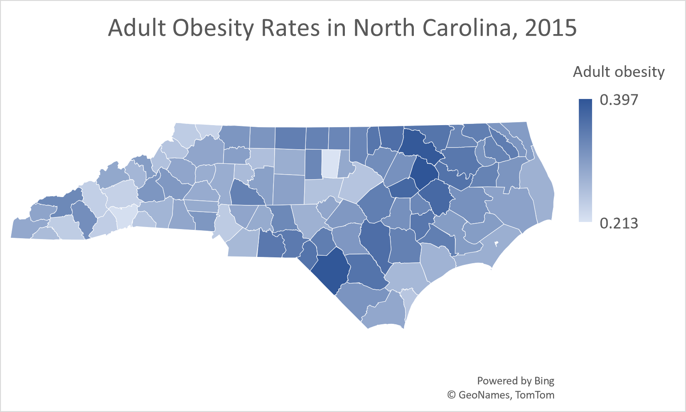

# Adult Obesity Rates in North Carolina
This is a repository containing data from a county dataset of health benchmarks across the country between 2014 and 2015. This repository contains subsetted data that assesses Adult obesity rates in North Carolina by county in 2015.

This repository includes the following files:
- This README.md file
- The original county health dataset
- Procedural documentation of subsetting the data
- [The final product subset of the data](https://github.com/gstharmar/105-Unit-3/blob/main/AdultObesityDataSubset(Excel).xlsx)
- [A data visualization of the subset](AdultObesityDataVisual.png)

This repository contains a python notebook highlighting the procedural process of compiling, indexing, and merging data to achieve statistics of Adult Obesity rates in NC. This data was derived from county health data and then indexed to produce the specific subset. The code was made in jupyter lab through the pandas package. This data/code serves the purpose of statistical analysis that can be conducted on the rates of Adult obesity across North Carolina by county in the year 2015. This repository was created to exhibit the variances in Adult Obesity rates in North Carolina by county. People might use this to compare adult obesity statistics between different counties and attribute reasons as for why that is. With adequate analysis and research, this repository could be used to assess where North Carolina stands in terms of obesity rates and could potentially evoke the development of a course of action against obesity in North carolina.

With obesity being a growing issue in today's society, I chose this specific dataset to draw notice to the alarming rates of obesity in North Carolina and I was curious of what the range of variation in the distribution would look like.

This repository also contains a [data visualization of Adult obesity rates in North Carolina by county](AdultObesityDataVisual.png). This visualization was generated using Microsoft Excel. This visualization compares values through exhibiting different rates and serves as an informative display of the distribution of adult obesity rates in all of North Carolina's counties.

## Data Visualization

This data visualization depicts variances in adult obesity rates in North Carolina by county in 2015.

## Acknowledgments
Thank you, Professor Gotzler for providing the county health dataset, assigning this project, and invigorating our understanding of the world of coding and data.
