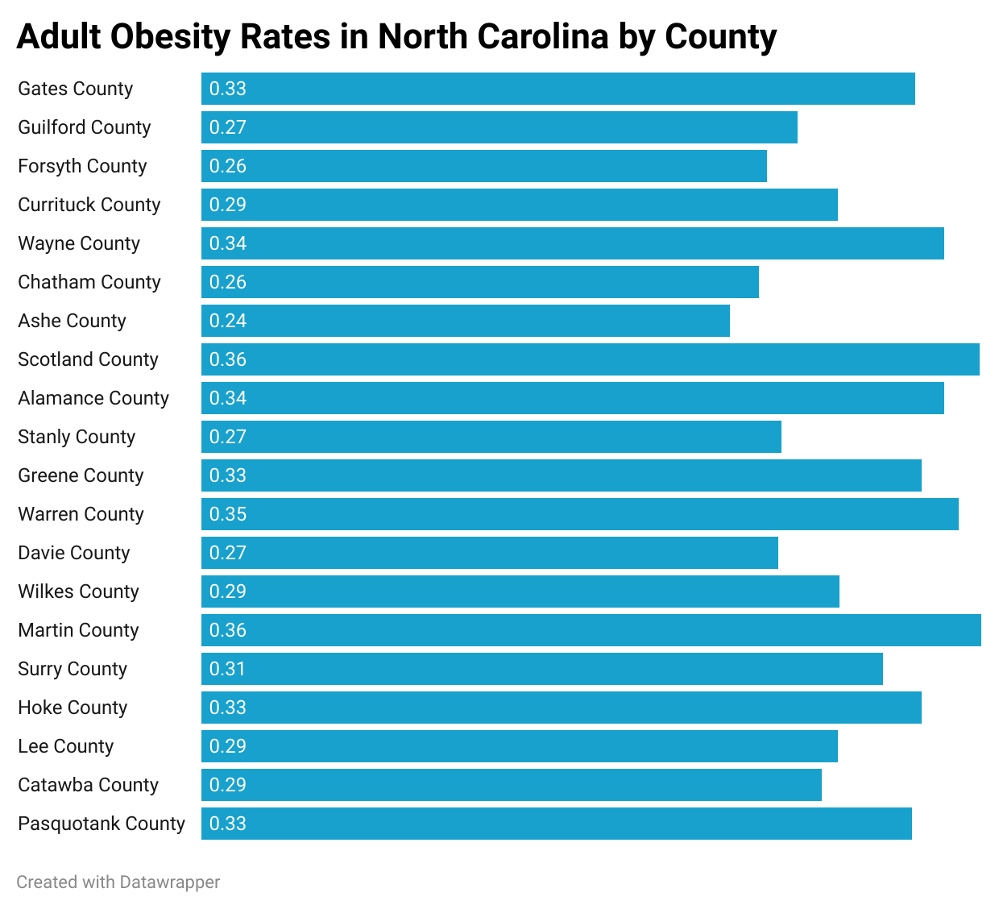

# 105-Unit-3
This is a repository containing datasets of health benchmarks across North Carolina by county.

This repository contains a python notebook highlighting the process of compiling and indexing data to achieve statistics of Adult Obesity rates in NC.

- Provenance: This data was derived from county health data and then indexed to produce the specific subset. The code was made in jupyter lab through the pandas package.
- Purpose: This data/code is for statistical analysis that can be conducted on the rates of Adult obesity across North Carolina by county.
- Potential: This repository was created to exhibit the variances in Adult Obesity rates in North Carolina by county. People might use this to compare adult obesity statistics between different counties and attribute reasons as for why that is.

This repository also contains a data visualization of Adult obesity rates in North Carolina from a sample of twenty counties. This visualization was generated using Datawrapper. This visualization compares values through exhibiting different rates and serves as an informative display of the distribution of adult obesity rates in twenty of North Carolina's counties.

